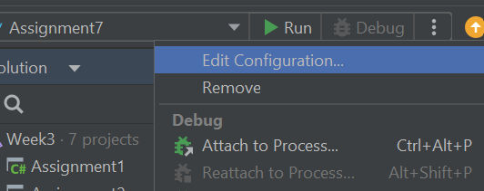
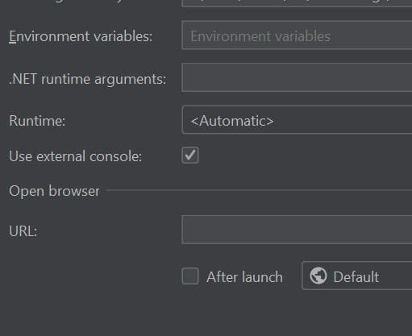
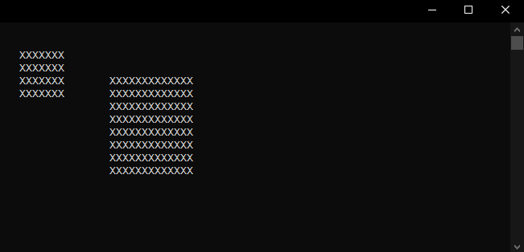
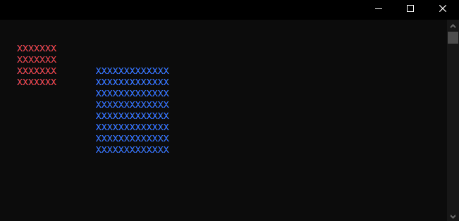

# 06 - Classes and objects

Today we will dive into domain driven design and learn how to write and use simple classes.

## Domain driven design

_Domain driven design_ is an abstract software development concept that's very common in large scale IT projects and elsewhere. In essence, the idea is to model the system to reflect the business domain (reality).

Although most languages provide basic data types for things like numbers and strings, those are rarely enough when trying to model the code to match the business domain. Instead, in C# we use _classes_ to create new custom data types for this.

## Classes

-   To design new data types in C# we can create a representation of the thing we want to model with the word `class`. A class is usually turned into one or more objects, _instances_ of that class, by using the keyword `new`.

-   Objects have properties and methods that reflect their state and behavior. Properties are accessed through a special `get` and `set` syntax.

-   In C# nothing inside a class is accessible to the outside unless we explicitly say so using _visibility modifiers_. The most permissive modifier is `public`, which means accessible for anyone. We will dive into this more later, today everything can be `public`.

-   Typically every class should be in their own file, however if we still want to keep everything in a single file then all classes need to be declared at the very end of it.

### Example

In this example we want to create two new data types, `MusicFile` and `AudioPlayer`.

```csharp
class MusicFile
{
    public string Artist { get; set; }
    public string Song { get; set; }
}

class AudioPlayer
{
    public void Play(MusicFile file)
    {
        Console.WriteLine($"Now playing: {file.Artist} - {file.Song}");
    }
}
```

A music file contains information about the artist and the song name, and an audio player can play files. We can then use `new` to create file and player _objects_ from the two classes.

```csharp
var file = new MusicFile()
{
    Artist = "Thy Art is Murder",
    Song   = "Keres"
};

var player = new AudioPlayer();
```

Finally, we can use the `Play()` method on the player object to (pretend) to play the music file object.

```csharp
player.Play(file);
```

<pre>
Now playing: Thy Art is Murder - Keres
</pre>

Although very basic, we have now created two custom domain specific objects that interact with each other.

<details>
<summary>Full code</summary>

```csharp

//
// Remember - as backwards as it might feel, if your application is a single file
// of code then any class declarations must be at the very end, or the program
// will simply not compile.
//

var file = new MusicFile()
{
    Artist = "Thy Art is Murder",
    Song   = "Slaves Beyond Death"
};

var player = new AudioPlayer();

player.Play(file);

class MusicFile
{
    public string Artist { get; set; }
    public string Song { get; set; }
}

class AudioPlayer
{
    public void Play(MusicFile file)
    {
        Console.WriteLine($"Now playing: {file.Artist} - {file.Song}");
    }
}
```

</details>

## Assignments

Let's write some classes!

### Assignment 1

For your first assignment you need to port the <a href="https://github.com/yrgo/wu23/blob/master/C%23/03%20-%20Strings/Solutions/Assignment6/Program.cs">password validator application</a> from last week into a reusable component. Create a class called `PasswordValidator` and copy and paste the validation logic into it so that it can be instantiated and used like this:

```csharp
var validator = new PasswordValidator();

if (validator.IsValidPassword("p4ssw0rd"))
{
    Console.WriteLine("the password 'p4ssw0rd' is a valid password");
}
```

<pre>
the password 'p4ssw0rd' is a valid password
</pre>

### Assignment 2

Now it's time to model a completely new system for a `Movie` and a `Cinema`.

-   A `Movie` has a `Name`, `AgeRating`, and a `Price`.
-   A `Cinema` can show a `Movie`.

It should work like this:

```csharp
var movie = new Movie()
{
    Name = "Ghostbusters",
    AgeRating = 11,
    Price = 60
};

var cinema = new Cinema()
{
    Movie = movie
};

// this method should print out which movie is currently showing
cinema.MovieInformation();
```

<pre>
We are currently showing: Ghostbusters (11 years or older, 60:-)
</pre>

### Assignment 3

Continue the code from the previous assignment and introduce a new class, `Person`.

A `Person` has a `Name` and can watch a movie at the cinema.

In addition to this new class, also create a `ShowMovieTo(Person)` method that will allow a person to watch the movie.

```csharp
var person = new Person()
{
    Name = "Guybrush",
};

// this should print "Welcome <name>, please enjoy the movie <movie>"
cinema.ShowMovieTo(person);
```

<pre>
Welcome Guybrush, please enjoy the movie Ghostbusters!
</pre>

### Assignment 4

Again continue the code from the previous assignment and add two new properties to the `Person` class, `Age` and `Money`.

Now when Guybrush goes to the movies, make sure to charge the price of admission.

```csharp
var person = new Person()
{
    Name = "Guybrush",
    Age = 19,
    Money = 100,
};

Console.WriteLine($"{person.Name} has {person.Money}:- in his pocket");

cinema.ShowMovieTo(person);

Console.WriteLine($"{person.Name} has {person.Money}:- in his pocket");
```

<pre>
Guybrush has 100:- in his pocket
Welcome Guybrush, please enjoy the movie Ghostbusters!
Guybrush has 40:- in his pocket
</pre>

But if Guybrush isn't old enough, or doesn't have enough money, the `ShowMovie()` method should instead print out a message saying this.

<details>
<summary>Not old enough</summary>

```csharp
var person = new Person
{
    Name = "Guybrush",
    Age = 7,
    Money = 100,
};

cinema.ShowMovieTo(person);
```

<pre>
I'm sorry Guybrush, you are not old enough.
</pre>
</details>

<details>
<summary>Not enough money</summary>

```csharp
var person = new Person
{
    Name = "Guybrush",
    Age = 19,
    Money = 30,
};

cinema.ShowMovieTo(person);
```

<pre>
I'm sorry Guybrush, you don't have enough money.
</pre>
</details>

### Assignment 5

_Welcome to your new job at the box factory!_

In this assignment we're going to treat the console window more like a canvas.

Today you'll create a box object, representing a rectangle on the screen. A `Box` has an `X`, `Y`, `Width` and `Height` property, and when you call `Draw()` on the box it will draw itself on the screen using those properties. It is pretty amazing.

```csharp
class Box
{
    public int X { get; set; }
    public int Y { get; set; }
    public int Width { get; set; }
    public int Height { get; set; }

    public void Draw()
    {
        // ...
    }
}
```

To move the cursor in the console window to a position you use the method `Console.SetCursorPosition`, like this:

```csharp
// write "hello" at position left 3, top 14
Console.SetCursorPosition(3, 14)
Console.Write("hello");
```

Your fantastic box application should work this way:

```csharp
// create two boxes
var box1 = new Box()
{
    X = 3,
    Y = 2,
    Width = 7,
    Height = 4
};

var box2 = new Box()
{
    X = 17,
    Y = 4,
    Width = 13,
    Height = 8
};

// then draw both on the screen
box1.Draw();
box2.Draw();
```

Doing this with the console window in Rider can be, ehm, rough. I suggest that you set you project to run in the external console:
<br>
Edit your run configuration from the three dots in the top right of Rider.
<br>

<br>
Then check the box for _Use External Console_.
<br>


<details>
<summary>Result</summary>
    
</details>

Getting this to work is a bit tricky, you'll need to use two nested `for` loops, then use the loop variables together with the `X` and `Y` properties to locate the cursor to the right position.

### Assignment 6

Turns out people don't use black and white monitors anymore and want their rectangles in color. Update your `Box` class to accept an argument of the type `ConsoleColor` in the `Draw()` method, then set the color using `Console.ForegroundColor = color`.

```csharp
box1.Draw(ConsoleColor.Red);
box2.Draw(ConsoleColor.Blue);
```

<details>
<summary>Result</summary>
    
</details>

### Assignment 7

> You might want to skip this assignment if you're sensitive to rapidly changing colors.

<a href="https://jwz.org/">Jamie Zawinski</a> was a famous open source developer in the late 90's who made his fortune on Netscape stock, left the industry and bought a nightclub in San Francisco and complained a lot. Apart from selling beer he's also the author and maintainer of <a href="https://en.wikipedia.org/wiki/XScreenSaver">XScreenSaver</a> for <a href="https://en.wikipedia.org/wiki/X_Window_System">X11</a>. One of the earliest screensavers in XScreenSaver is named _Greynetic_, all it does is draw colored boxes in different random sizes to the screen over and over again. Let's do that!

-   To "draw" in a solid color you set `Console.BackgroundColor` and draw empty spaces.
-   The size of the window can be obtained from in `Console.WindowWidth` and `Console.WindowHeight`.
-   You can use `System.Threading.Thread.Sleep(100)` to slow down the drawing if you think it's running too fast.

Here's some example code that draw a straight line in a random color:

```csharp
// generate a random color
var random = new Random();
var color  = (ConsoleColor)random.Next(1, 16);

// draw something with it on position 10, 5
Console.BackgroundColor = color;
Console.SetCursorPosition(10, 5);
Console.Write("          ");
```

This is the masterpiece you're going for:

<details>
<summary>Result</summary>
    
</details>

### Assignment 8 (Extra)

Last time we wrote a <a href="https://github.com/HannesAlexandersson/programmering-c-sharp/blob/main/03-str%C3%A4ngar/solutions/program.cs">simple game</a> where you guess a random number between 1 and 100.

Now update the game with a computer controlled opponent to play against.

The computer should play by the exact same rules as you do - it does not know the number, but it understand the hints just like another person would. This means that if either player guesses the number to be 45, and the game reveal that the number is too high, the computer opponent knows that the correct number has to be lower than 45.

<pre>
Human vs super advanced AI computer. FIGHT!

Human guess: <b>80</b>
too high<br>
Computer guesses the number is 46
too high<br>
Human guess: <b>20</b>
too low<br>
Computer guesses the number is 37
too high<br>
Human guess: <b>33</b>
33 is correct, human is the winner
</pre>
