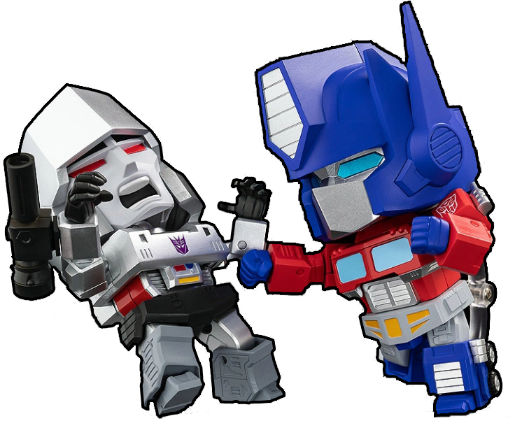

# 05 - Classes And Objects 2

Today, we'll look at C# constructors and learn how properties really work ...And we will create zombie cats and build a robot fighting game, wow!

## Constructors

A constructor is a special method without a return type that is called automatically when we use `new` to create an object. Its purpose is to initialize the new object into a working state, and once the object is created the constructor can never be called again.

A class will always have at least one constructor, and if we don't write one then the system will automatically create an empty constructor that doesn't take any arguments.

```csharp
class Person
{
  // This class has an implied empty constructor, making it possible to do "new Person()"
}

var person = new Person();
```

Once a constructor is written in the class the implied constructor is no longer created automatically.

```csharp
class Person
{
    public string Name { get; set; }

    public Person(string name)
    {
        Name = name;
    }
}

// This no longer works
// var person = new Person();

var person = new Person("Guybrush Threepwood");
```

## Properties explained

> If you know Java and think properties are weird: Behind the scenes `get;` and `set;` are actually just two shortcut methods for a backing field that's automatically generated, it saves _a lot_ of typing compared to Java.

As we have seen previously, properties are used to expose data with a special `{ get; set; }` syntax.

```csharp
class Person
{
    public string Name { get; set; }
}
```

If we want to make the property _read only_ we can simply remove the `set`, this changes the property so that it can only be set in the constructor of the class:

```csharp
class Person
{
    public string Name { get; }

    public Person(string name)
    {
        Name = name;
    }
}

// this works
var person = new Person("Guybrush Threepwood");

// this doesn't compile
// person.Name = "Zak McKracken";
```

Properties are actually a kind of methods, it is possible to call other methods from them or do calculations.

```csharp
class Price
{
    public int Value { get; }
    public double Vat { get; }

    public double Total
    {
        get { return Value + (Value * Vat); }
    }

    // or, using arrow syntax the above can be written like this
    // public double Total => Value + (Value * Vat);

    public Price(int value, double vat)
    {
        Value = value;
        Vat = vat;
    }
}
```

We can now use the price class above to have the `Total` property return the price with Vat included. By removing the `set` it's also not possible to change the price once it's been created.

```csharp
var price = new Price(100, 0.25);
Console.WriteLine($"Price inc VAT = {price.Total:F2}");
```

<pre>
Price inc VAT = 125,00
</pre>

## Assignments

Zombie cats and robots! But first, FizzBuzz.

### Assignment 5-1

The FizzBuzz problem has become something of a classic when doing code interviews, so better you do it now when your employment is not at stake!

_Write a program that prints the numbers from 1 to 100. But for multiples of three print "Fizz" instead of the number and for the multiples of five print "Buzz". For numbers which are multiples of both three and five print "FizzBuzz"._

<pre>
1
2
Fizz
4
Buzz
Fizz
7
8
Fizz
Buzz
11
Fizz
13
14
FizzBuzz
etc...
</pre>

<details>
<summary>Hint</summary>

You should use modulus (%) to solve this: `x % y == 0` means `x` is dividable by `y` with no remainder.

</details>

> If you care, the FizzBuzz interview question originates from <a href="https://blog.codinghorror.com/why-cant-programmers-program/">this blog post</a>, written by Jeff Atwood, founder of Stack Overflow.

### Assignment 5-2


_You can do **Assignment 5-2a** to **Assignment 5-2c** in one single project._

In steps you're going to create a `Cat` class. Cats can be zombies. Cats that are zombies can turn normal cats into more zombies cats. Obviously.

### Assignment 5-2a

Start by creating a normal cat. A cat has a readonly `Name` property and a `Speak()` method that return the text _Meow!_

```csharp
var cat = new Cat("Luna");

Console.WriteLine($"{cat.Name} says: {cat.Speak()}");
```

<pre>
Luna says: Meow!
</pre>

### Assignment 5-2b

Add a boolean `Zombie` property and have the constructor take a second argument to set it. Zombie cats do not say "Meow!", they say _<a href="https://www.youtube.com/watch?v=E6K9zK9ZWSg">Braaaaains!</a>_.

```csharp
var luna = new Cat("Luna", false);
var artemis = new Cat("Artemis", true);

Console.WriteLine($"{luna.Name} says: {luna.Speak()}");
Console.WriteLine($"{artemis.Name} says: {artemis.Speak()}");
```

<pre>
Luna says: Meow!
Artemis says: Braaaaains!
</pre>

### Assignment 5-2c

Finally, implement a `Eat(Cat)` method on the class where one cat will eat another.

It should work like this:

If the cat eating is not a zombie cat, print out the text _What?! I will not eat (name of other cat)!_ and do nothing.

```csharp
var luna = new Cat("Luna", false);
var artemis = new Cat("Artemis", true);

luna.Eat(artemis);  // Luna is not a zombie cat, normal cats don't eat other cats
```

<pre>
What?! I will not eat Artemis!
</pre>

If the cat eating is a zombie, and the cat being eaten is not, print out _Nom nom nom_ and turn the other cat into a zombie by updating its `Zombie` property.

```csharp
var luna = new Cat("Luna", false);
var artemis = new Cat("Artemis", true);

Console.WriteLine($"{luna.Name} says: {luna.Speak()}");

artemis.Eat(luna);  // Artemis is a zombie cat, turning Luna into a zombie cat too!

Console.WriteLine($"{luna.Name} says: {luna.Speak()}");
```

<pre>
Luna says: Meow!
Nom nom nom
Luna says: Braaaaains!
</pre>

If _both_ cats are zombies, do nothing at all (zombie cats don't eat on each other out of curtesy)

### Assignment 5-3



_You can do **Assignment 5-3a** to **Assignment 5-3d** in one single project._

Next, you're assigned a task to write a robot game that plays itself.

-   The game has two robot players
-   Each robot has a name and health points
-   The robots attack each other by throwing a normal die
-   The game ends when one or both robots run out of health
-   This might not be the best game ever

### Assignment 5-3a

Since we are serious developers: the correct way to implement a shared die with six sides is to implement it in a `static class`, and since we've not yet covered `static` just copy and paste this class somewhere:

```csharp
static class Die
{
    static readonly Random _random = new();
    public static int Roll() => _random.Next(1, 7);
}
```

Now, to use the die anywhere in your program use `Die.Roll()` and it will return a value between 1 and 6.

```csharp
var result = Die.Roll();

Console.WriteLine($"The value is: {result}"); // The value is (some value between 1-6)
```

### Assignment 5-3b

Start by creating the `Robot` class, it's very simple:

```csharp
var megatron = new Robot("Megatron", 10);

Console.WriteLine($"Name   : {megatron.Name}");
Console.WriteLine($"Health : {megatron.Health}hp");
```

<pre>
Name   : Megatron
Health : 10hp
</pre>

### Assignment 5-3c

Next, add a method where one robot can attack another.

```csharp
var megatron = new Robot("Megatron", 10);
var optimus = new Robot("Optimus Prime", 10);

// "x attacks y with n damage!"
megatron.Attack(optimus);

Console.WriteLine($"Megatron health: {megatron.Health}hp");
Console.WriteLine($"Optimus health: {optimus.Health}hp");
```

<pre>
Megatron attacks Optimus Prime with 4 damage!
Megatron health: 10
Optimus heatlh: 6
</pre>

Use `Die.Roll()` to subtract its value from the Robot that's being attacked.

### Assignment 5-3d

Next, implement the `RobotFightingGame` class.

The game take two `Robot` objects as arguments and pit them against each other until either one has 0 or less health.

-   The game is played using a `NextRound()` method that simply have the robots hit each other
    one time each.
-   The game should have a `GameOver` property that is set to `true` when the game is over.
-   The game should have a `Winner` property that is set to the name of the winning robot.
-   If both robots die in the same round\*, `GameOver` should be `true` and `Winner` set to `null` (no value).

```csharp
// create two players
var megatron = new Robot("Megatron", 10);
var optimus = new Robot("Optimus Prime", 10);

// create the game
var game = new RobotFightingGame(megatron, optimus);

// play the game until someone wins
while (!game.GameOver)
{
    game.NextRound();
}

if (game.Winner == null)
{
    Console.WriteLine("The game ends in a draw! What a disappointment!");
}
else
{
    Console.WriteLine($"{game.Winner} is the winner!");
}
```

<pre>
Megatron attacks Optimus Prime with 6 damage!
Optimus Prime attacks Megatron with 6 damage!
Megatron attacks Optimus Prime with 5 damage!
Optimus Prime attacks Megatron with 2 damage!
Megatron is the winner!
</pre>

> \*&nbsp;What? This is totally realistic as both <a href="https://en.wikipedia.org/wiki/Optimus_Prime">Optimus Prime</a> and <a href="https://en.wikipedia.org/wiki/Megatron">Megatron</a> use laser weapons and could fire at the same time. Pew pew pew!

### Assignment 5-4 (Extra)

Create a `Star` object that move itself in random directions on the screen and leave a trail of stars. Amazing!

The star should start at a random position on the screen and move itself in a random diagonal pattern until it hit the border of the terminal, then it should bounce in the opposite direction.

```csharp
var star = new Star();

while(true)
{
    star.Move();
}
```

<details>
    <summary>
    Annoying animated gif
    </summary>

</details>

If your star moves too fast then you can slow it down by introducing a delay with this line of code in the `Move` method:

```csharp
Thread.Sleep(10)
```

You get the height and width of the console with `Console.WindowWidth` and `Console.WindowHeight`. The star class really only need to contain a random generator and keep track of its position and in which direction it currently moves.

_Pro-tip: If you multiply a number with -1 it will swap the value from negative to positive and vice versa. You can use this to make changing the directions easier (or see my solution if that made no sense, this trick is Good To Know™ and very common in 2D game development)._
