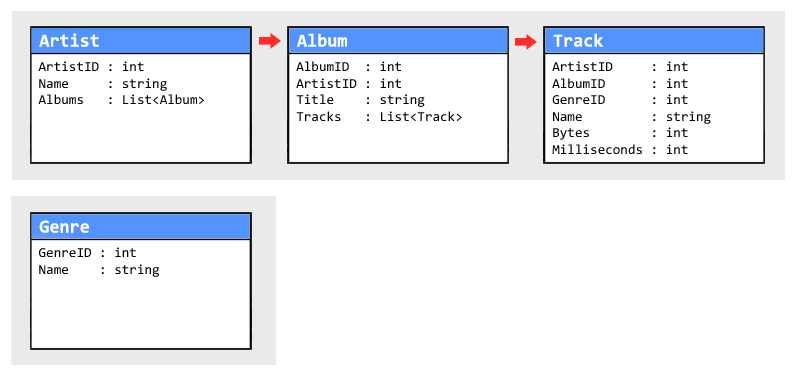

# LINQ - Language Integrated Query

LINQ is a C# feature used to query data, you can think of it as SQL built into the language itself.

There are a lot of LINQ operators, and even more if you include third party extensions, but we only need to use the most common today. Thinking in LINQ does take some time to get used to, but knowing SQL it's really not that hard once you grasp the basic syntax.

A LINQ query that returns a new result set is a stream of data that's neither an array or a a list, but we can convert it by ending the query with `.ToArray()` or `.ToList()`

| Method                | Does what                             | Example                                          | Result  |
| --------------------- | ------------------------------------- | ------------------------------------------------ | ------- |
| **Where**             | Filter                                | `new[] { 3, 4, 1, 2 }.Where(x => x > 1)`         | 3,4,2   |
| **OrderBy**           | Sort <                                | `new[] { 3, 4, 1, 2 }.OrderBy(x => x)`           | 1,2,3,4 |
| **OrderByDescending** | Sort >                                | `new[] { 3, 4, 1, 2 }.OrderByDescending(x => x)` | 4,3,2,1 |
| **First**             | Return the first result               | `new[] { 3, 4, 1, 2 }.First(x => x < 3)`         | 1       |
| **Take**              | Return the first _n_ result           | `new[] { 3, 4, 1, 2 }.Take(2)`                   | 3,4     |
| **Count**             | Count the result                      | `new[] { 3, 4, 1, 2 }.Count(x => x > 1)`         | 3       |
| **Select**            | Select a subset or transform a result | `new[] { 3, 4, 1, 2 }.Select(x => x * 2)`        | 6,8,2,4 |
| **Sum**               | Sum of values                         | `new[] { 3, 4, 1, 2 }.Sum()`                     | 10      |
| **Average**           | Average of values                     | `new[] { 3, 4, 1, 2 }.Average()`                 | 2.5     |
| **Distinct**          | Remove duplicates                     | `new[] { 1, 1, 1, 2 }.Distinct()`                | 1,2     |

Additionally you'll want to use the **SelectMany** operator to flatten the lists when needed, like so:

```csharp
// select every album in the database, and convert it to a List<Album>
var albums = Database.Artists
                .SelectMany(artist => artist.Albums);
                .ToList();

// and we can do something like this to select every track in the database
var tracks = Database.Artists
                .SelectMany(artist => artist.Albums)
                .SelectMany(album => album.Tracks);

// no need to convert it if all we're doing it using a foreach on the result
foreach (var track in tracks)
{
    Console.WriteLine(album);
}
```

> The **Select** and **SelectMany** operators are often called "map" and "flatmap" in other languages.

## Assignments

Let's practice writing LINQ queries!

Today we're going to use LINQ to query data using a subset of the SQL example database <a href="https://github.com/lerocha/chinook-database">Chinook</a>, which contains normalized relational data from a fictional media company.

Henrik has prepared a <a href="MusicLinq.zip">C# project</a> where the tables below have been converted into a new in-memory database for you to play around with.

<p align="center">
    
</p>

<!--
If you need more examples then
<a href="https://linqsamples.com/linq-to-objects/">LINQ Samples</a> is a good resource with short simple queries for every operator.
-->

## Assignment 9-1a

Begin by downloading <a href="MusicLinq.zip">MusicLinq.zip</a> and open the `MusicLinq.sln` file in Rider. The `MusicLinq.Client` project will provide you with some small example code to get you started.

### Exercise 1

List all artists that start with the letter "D" in alphabetical order

<details>
 <summary><b>Result</b></summary>
<pre>
David Coverdale
Deep Purple
Def Leppard
Dennis Chambers
Dhani Harrison & Jakob Dylan
DJ Dolores & Orchestra Santa Massa
Djavan
Dread Zeppelin
</pre>
</details>

### Exercise 2

List all artists that have more than five albums in the database.

<details>
 <summary><b>Result</b></summary>
 <pre>
Led Zeppelin
Metallica
Deep Purple
Iron Maiden
Ozzy Osbourne
U2
</pre>
</details>

### Exercise 3

List all artists that have a name with four or less characters, in alphabetical order.

<details>
 <summary><b>Result</b></summary>
 <pre>
Cake
JET
Kiss
Lost
Otto
Rush
U2
UB40
Xis
</pre>
</details>

### Exercise 4

List the title of all albums that have exactly two tracks.

<details>
 <summary><b>Result</b></summary>
 <pre>Blizzard of Ozz
No More Tears (Remastered)
Quiet Songs
Muso Ko
Realize
Every Kind of Light
The World of Classical Favourites
English Renaissance</pre>
</details>

### Exercise 5

Count how many tracks there are in the database in total.

<details>
 <summary><b>Result</b></summary>
 <pre>3503</pre> 
</details>

### Exercise 6

Count the number of unique track names.

<details>
 <summary><b>Result</b></summary>
 <pre>3257</pre> 
</details>

### Exercise 7

Calculate the average file size in bytes.

<details>
 <summary><b>Result</b></summary>
 <pre>33510207 bytes</pre> 
</details>

### Exercise 8

List all albums where the artist is "Various Artists".

<details>
 <summary><b>Result</b></summary>
  <pre>
Axé Bahia 2001
Carnaval 2001
Sambas De Enredo 2001
Vozes do MPB
</pre>
</details>

### Exercise 9

Calculate how many hours of music there is in the database.

<details>
 <summary><b>Result</b></summary>
 <pre>382</pre>
</details>

### Exercise 10

List the 10 artists with most albums in the database.

<details>
 <summary><b>Result</b></summary>
 <pre>
Iron Maiden
Led Zeppelin
Deep Purple
Metallica
U2
Ozzy Osbourne
Pearl Jam
Various Artists
Faith No More
Foo Fighters
</pre> 
</details>

## Assignment 9-1b (Extra)

### Exercise 11

List the name of the track with longest runtime, with the time shown in minutes.

<details>
 <summary><b>Result</b></summary>
 <pre>Occupation / Precipice (88 minutes)</pre>
</details>

### Exercise 12

List all tracks that contain the word "Yesterday", with the time displayed in "mm:ss" format.

<details>
 <summary><b>Result</b></summary>
 <pre>
Yesterday To Tomorrow (04:33)
Yesterdays (03:16)
No Sign of Yesterday (06:02)
</pre> 
</details>

### Exercise 13

Write a method that takes an artist name as its only parameter. The method should write out the name of the artist, the number of albums available in the database, the name of each album, and every track numbered.

Although it is possible, you don't have to do this in one single query.

<details>
    <summary><b>Result</b></summary>
    <pre>Artist: Queen
Albums: 3 albums in database
  Greatest Hits II
    01. A Kind Of Magic
    02. Under Pressure
    03. Radio GA GA
    04. I Want It All
    05. I Want To Break Free
    06. Innuendo
    07. It's A Hard Life
    08. Breakthru
    09. Who Wants To Live Forever
    10. Headlong
    11. The Miracle
    12. I'm Going Slightly Mad
    13. The Invisible Man
    14. Hammer To Fall
    15. Friends Will Be Friends
    16. The Show Must Go On
    17. One Vision
  Greatest Hits I
    01. Bohemian Rhapsody
    02. Another One Bites The Dust
    03. Killer Queen
    04. Fat Bottomed Girls
    05. Bicycle Race
    06. You're My Best Friend
    07. Don't Stop Me Now
    08. Save Me
    09. Crazy Little Thing Called Love
    10. Somebody To Love
    11. Now I'm Here
    12. Good Old-Fashioned Lover Boy
    13. Play The Game
    14. Flash
    15. Seven Seas Of Rhye
    16. We Will Rock You
    17. We Are The Champions
  News Of The World
    01. We Will Rock You
    02. We Are The Champions
    03. Sheer Heart Attack
    04. All Dead, All Dead
    05. Spread Your Wings
    06. Fight From The Inside
    07. Get Down, Make Love
    08. Sleep On The Sidewalk
    09. Who Needs You
    10. It's Late
    11. My Melancholy Blues
</pre>
</details>

## Assignment 9-2 (Very extra)

_Oh hey! It's your pals from The Map Company! We need help yet again. The dots are still water, a # is still land, and now we need to figure out how much shoreline there is on <a href="map.txt">this map</a>._

Lakes should be included but anything outside of the boundaries of the map is considered unknown territory and should not be assumed to be either land or water.

One single stretch of shoreline is 10m, so the map below has 22 x 10 = 220m of shoreline.

<p align="center">
    
</p>

\*_Spoiler: The included map has 860 meters of shoreline._
